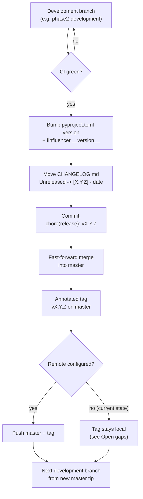

# Releasing

This document covers the **process and mechanics** of cutting a software
release: branching, tagging, and the CHANGELOG. It assumes the versioning
*policy* explained in [`docs/VERSIONING.md`](VERSIONING.md) — read that
first if the distinction between the software version and the
research/citation version is not already clear. Everything below concerns
only the software version axis (`pyproject.toml`).

## Quick reference: pre-release checklist

- [ ] CI green (lint + full OS/Python matrix)
- [ ] `tests/unit/test_version_sync.py` passes
- [ ] `pyproject.toml` version bumped, `__version__` matches
- [ ] `CHANGELOG.md` has a dated entry
- [ ] `CITATION.cff` left untouched
- [ ] Relevant milestone review sign-off given

(Full explanation of each item: "Release readiness checklist" below.)

## Semantic Versioning

`pyproject.toml`'s `[tool.poetry].version` follows
[SemVer](https://semver.org/) (`MAJOR.MINOR.PATCH`). The package is
currently pre-1.0 (`0.1.0`), so SemVer's own pre-1.0 exception applies:
`0.x` releases may include breaking changes in a `MINOR` bump; there is no
stability guarantee until `1.0.0`.

Once `1.0.0` is reached, standard SemVer rules apply. For this package,
"breaking" means any of:

- A CLI command, flag, or documented exit code changes or is removed
  (`finfluencer.cli`, `finfluencer.reporting.main`).
- `AnalysisJob`'s public constructor signature or public methods change
  incompatibly.
- `run_reporting_pipeline`'s signature or the shape of its return value
  changes incompatibly.
- A `config/settings.yaml` or `config/analysts.yaml` schema change that
  is not backward compatible with existing config files.

Anything else (bug fixes, new optional CLI flags, new stages, internal
refactors that preserve the above) is `MINOR` or `PATCH` as appropriate.

### Version decision matrix

| Change | Example | Pre-1.0 (`0.x`) bump | Post-1.0 bump |
|---|---|---|---|
| Breaking API/CLI/config change | Rename a CLI flag; change `AnalysisJob.__init__`'s signature; incompatible config schema change | `MINOR` (`0.1.0` → `0.2.0`) | `MAJOR` (`1.2.3` → `2.0.0`) |
| Backward-compatible new feature | New optional CLI flag; new reporting stage; new `AnalysisJob` method | `MINOR` (`0.1.0` → `0.2.0`) | `MINOR` (`1.2.3` → `1.3.0`) |
| Backward-compatible bug fix | Fix a wrong exit code; fix a computation error with no interface change | `PATCH` (`0.1.0` → `0.1.1`) | `PATCH` (`1.2.3` → `1.2.4`) |
| Internal-only change (no public interface touched) | Refactor a private helper; add a test; update a comment | `PATCH` (or no release at all — batch into the next `MINOR`) | `PATCH` (or no release at all) |
| First stable API guarantee | The CLI/`AnalysisJob`/`run_reporting_pipeline` surface is considered stable | -- | Cut `1.0.0` |

Pre-1.0, `MAJOR` is not used for anything (SemVer reserves the `0.x.y` →
`1.0.0` transition itself as the signal that a stability guarantee now
exists — there is no pre-1.0 equivalent of a "breaking major bump").
`PATCH` pre-1.0 is optional discipline, not a SemVer requirement; batching
small fixes into the next `MINOR` is acceptable for a project at this
release cadence.

## Branch strategy

Current reality (not an aspirational model — this reflects the actual
repository state as of Sprint 2.7A):

- `master` — the last tagged release. Currently sits exactly at
  `v0.1.0-phase1` ("Phase 1 baseline"). Always releasable; nothing is
  committed directly to `master` outside of a release.
- `phase2-development` — the active development branch for the current
  release cycle (Sprint 2 / Sprint 2.7A work). It is a strict
  fast-forward descendant of `master` (55 commits ahead, 0 behind as of
  this writing) — no divergent history to reconcile.
- No remote is currently configured (`git remote -v` is empty). This is a
  known gap, not a design choice — see "Open gaps" below.

Going forward, this project uses **one long-lived development branch per
release cycle**, named for the phase/sprint it corresponds to (matching
existing precedent, e.g. `phase2-development`). At release time it is
merged into `master` (fast-forward, since it is kept as a descendant of
`master` rather than allowed to diverge) and the next cycle's branch is
created from the new `master` tip. This is intentionally simple — a
single-maintainer research project (per `CONTRIBUTING.md`) does not need
GitFlow-style `develop`/`release`/`hotfix` branch families. If external
contributors become common, short-lived feature branches merged into the
current development branch via pull request are the natural extension of
this model; it does not require restructuring `master`'s role.

## Release process

1. **Confirm the development branch is release-ready.** All CI checks
   green (scoped lint gate + full test matrix, see
   `.github/workflows/ci.yml`), no open blocking items in the relevant
   milestone's own review.
2. **Bump the software version.** Edit `pyproject.toml`'s
   `[tool.poetry].version` (or use `poetry version <patch|minor|major>`).
   Update `finfluencer.__version__` in `src/finfluencer/__init__.py` to
   match exactly — `tests/unit/test_version_sync.py` fails until this is
   done; treat that failure as the checklist item it is.
3. **Update `CHANGELOG.md`.** Move the accumulated `## [Unreleased]`
   entries (see "CHANGELOG policy" below) into a new
   `## [X.Y.Z] - YYYY-MM-DD` section, dated the day of the release.
4. **Commit** the version bump and CHANGELOG update together, e.g.
   `chore(release): v0.2.0`.
5. **Merge into `master`.** Since the development branch is kept as a
   fast-forward descendant of `master`, this is a fast-forward merge, not
   a merge commit.
6. **Tag `master`** at the release commit with an annotated tag (see "Tag
   strategy" below).
7. **Push** `master` and the tag to the remote, once one is configured
   (see "Open gaps"). Until then, the tag exists locally only.
8. **Create the next development branch** from the new `master` tip if
   another development cycle is starting immediately.

### Release flow diagram

## Tag strategy

- Format: `vMAJOR.MINOR.PATCH` (e.g. `v0.2.0`). The one existing tag,
  `v0.1.0-phase1`, used a `-phase1` suffix specific to the Phase 1
  baseline; that suffix is not part of the ongoing convention — releases
  from Sprint 2 onward use the plain `vMAJOR.MINOR.PATCH` form.
- Annotated tags only (`git tag -a`), never lightweight tags — an
  annotated tag carries its own message, date, and tagger, which a
  lightweight tag does not.
- Tag message: a one-line summary of the release (not the full CHANGELOG
  entry — the tag points to the commit that has it).
- Tags are created only on `master`, only at the exact commit that bumped
  `pyproject.toml`'s version.

## CHANGELOG policy

`CHANGELOG.md` follows [Keep a Changelog](https://keepachangelog.com/)
format going forward:

- One `## [X.Y.Z] - YYYY-MM-DD` section per software release, most recent
  first, `X.Y.Z` matching the `pyproject.toml` version at that release.
- An `## [Unreleased]` section at the top accumulates entries as they
  land on the development branch; it is renamed to `## [X.Y.Z] -
  YYYY-MM-DD` at release time (step 3 above) and a fresh empty
  `## [Unreleased]` is added above it.
- Within a release section, group entries under `Added` / `Changed` /
  `Fixed` / `Deprecated` / `Removed` / `Security` subheadings as
  applicable (omit empty ones).
- **The existing `## [1.0.0] - 2026-07-26` entry predates this policy and
  is not a software release.** It documents a research-infrastructure
  milestone (entity-centric migration v2, Run Manifest System, Market
  subsystem) that happens to share its version number with
  `CITATION.cff`'s research/citation version — see `docs/VERSIONING.md`
  for why those are a separate axis from the software version. It is
  left in place as an accurate historical record and is not renumbered,
  reworded, or removed. **The first software release under this policy
  is `[0.2.0]`**, matching `pyproject.toml`, not `[2.0.0]` — do not read
  the existing `[1.0.0]` entry as a starting point for software-version
  continuity.

## Release readiness checklist

A release is not cut until all of the following hold:

- [ ] CI is green on the development branch (lint + full OS/Python matrix).
- [ ] `tests/unit/test_version_sync.py` passes (version bump is complete
      and consistent).
- [ ] `CHANGELOG.md` has a dated entry for this version.
- [ ] `pyproject.toml`'s version and `finfluencer.__version__` match.
- [ ] `CITATION.cff` is deliberately **not** touched as part of this
      checklist — it changes only on its own, independent schedule (see
      `docs/VERSIONING.md`).
- [ ] Any milestone-specific review sign-off for the work being released
      has been given (per this project's own review-gate discipline).

## Open gaps

These are known, deliberately out of scope for this document and for
Sprint 2.7A:

- **No remote configured.** `git remote -v` is currently empty; steps 7–8
  above (push, PyPI/GitHub Release publishing) cannot execute until one
  is added. Adding a remote and deciding on a hosting/CI-trigger strategy
  is an infrastructure decision for whoever operationalizes the next
  release, not a Sprint 2.7A code or documentation change.
- **No automated release workflow.** `.github/workflows/ci.yml` runs
  lint and tests on every push/PR; it does not build, tag, or publish a
  release. Automating steps 2–7 above (e.g. a `release` GitHub Actions
  workflow triggered by a tag push) is a reasonable Sprint 2.7B/Sprint 3
  candidate once a remote exists, not part of this milestone's "only
  what is necessary" CI scope.
- **No PyPI publishing.** This package is not currently published
  anywhere; `poetry build`/`poetry publish` are not wired into CI. Out of
  scope for the same reason.
