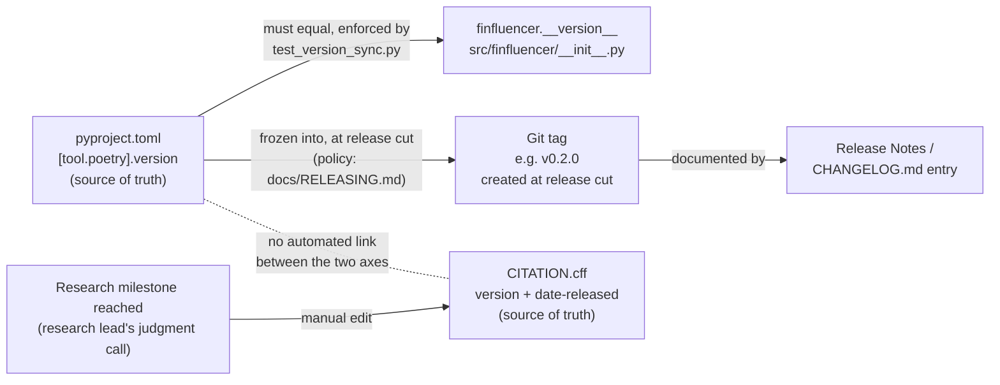

# Versioning Policy

This project tracks **two independent version numbers**. They are not
related, must not be inferred from one another, and are allowed to diverge
indefinitely. Conflating them previously produced a real bug (documented
below); this document exists to prevent that from happening again.

## 1. Software version — `pyproject.toml`

- **Source of truth:** `[tool.poetry].version` in `pyproject.toml`.
- **Mirrored by:** `finfluencer.__version__` in `src/finfluencer/__init__.py`.
  These two values must always be exactly equal; `tests/unit/test_version_sync.py`
  enforces this.
- **Follows:** [Semantic Versioning](https://semver.org/) (`MAJOR.MINOR.PATCH`).
- **Tracks:** the Python package's public API — the CLI
  (`finfluencer.cli`, `finfluencer.reporting.main`), `AnalysisJob`,
  `run_reporting_pipeline`, the provider registry, and anything else an
  external caller can import and depend on.
- **Current value:** `0.1.0`. This is deliberately pre-1.0: under SemVer,
  a `0.x` version permits breaking changes between minor releases without
  a major-version bump. That is an honest description of this package's
  current state — the reporting CLI and orchestration API are still under
  active hardening (Sprint 2.7A) and Sprint 3 is expected to extend them
  further before any API-stability guarantee is made.
- **When it changes:** only at an actual tagged release, never mid-sprint.
  Sprint 2.7A's hardening work does not itself bump this number; the bump
  happens at the release cut (see `docs/RELEASING.md`, a later milestone).
- **Consumed by:** `pip`/`poetry` package resolution and anything that
  imports `finfluencer` and reads `finfluencer.__version__`.

## 2. Research / citation version — `CITATION.cff`

- **Source of truth:** `CITATION.cff`'s `version:` and `date-released:`
  fields — used by anyone citing this repository in academic work (e.g.
  via GitHub's "Cite this repository" feature).
- **Tracks:** the completeness of the underlying research
  infrastructure/study this platform supports — *not* the software
  package's API stability.
- **Current value:** `1.0.0`, dated `2026-07-26`, recording completion of
  the entity-centric migration v2 (scope-based analysis layer), the Run
  Manifest System, and the Market subsystem (BIST100/TCMB EVDS
  integration). This is a research-infrastructure milestone, not a
  software package release.
- **When it changes:** only when the citable research artifact itself
  reaches a new, citation-worthy milestone. This is a judgment call for
  the research lead, not something CI or tooling should automate or
  infer from the software version.
- **`CITATION.cff` is never edited to "match" the software version.**

## Relationship diagram

Two independent chains, deliberately not wired together: `pyproject.toml`
drives `__version__`, Git tags, and release notes (the **software**
lifecycle); a research milestone drives `CITATION.cff` on its own
schedule (the **research/citation** lifecycle). The dotted line is the
one relationship that must *never* become a solid arrow — no script,
release process, or habit should ever copy one axis's value into the
other, which is exactly how TD-10 happened.

## Why this split exists (TD-10)

Before this policy was written, `src/finfluencer/__init__.py`'s
`__version__` was accidentally bumped from `"0.1.0"` to `"1.0.0"` — copying
`CITATION.cff`'s research version — while `pyproject.toml` still declared
`"0.1.0"`. This silently produced two disagreeing claims about the
*software's* own version (the package metadata said `0.1.0`, the runtime
attribute said `1.0.0`) and, worse, implicitly claimed the CLI/orchestration
API was 1.0-stable when it demonstrably was not (Sprint 2.7A itself exists
because it wasn't release-ready). That change was reverted as part of
Sprint 2.7A's Versioning milestone; this document is the fix for the
underlying cause, not just the symptom.

## Rules going forward

1. `pyproject.toml`'s `[tool.poetry].version` and `finfluencer.__version__`
   must always be equal. `tests/unit/test_version_sync.py` fails CI if they
   drift.
2. `CITATION.cff`'s version is independent and is never auto-derived from,
   or used to derive, `pyproject.toml`'s version.
3. `CHANGELOG.md`'s own policy (what triggers an entry, how it maps to
   the software version) is defined in `docs/RELEASING.md`
   (Sprint 2.7A's Release Engineering milestone). Its existing `[1.0.0]`
   entry pre-dates that policy and documents the same research milestone
   as `CITATION.cff`'s current version — not a software package release.
   Entries added after this policy takes effect correspond to
   `pyproject.toml`'s software version.
4. The software version is bumped only at an actual tagged release,
   documented in `docs/RELEASING.md`.

## Current values (as of Sprint 2.7A)

| Axis | Source | Value | Meaning |
|---|---|---|---|
| Software version | `pyproject.toml` / `finfluencer.__version__` | `0.1.0` | Pre-1.0; CLI/orchestration API still evolving |
| Research/citation version | `CITATION.cff` | `1.0.0` (2026-07-26) | Entity-centric migration v2, Run Manifest System, Market subsystem complete |
